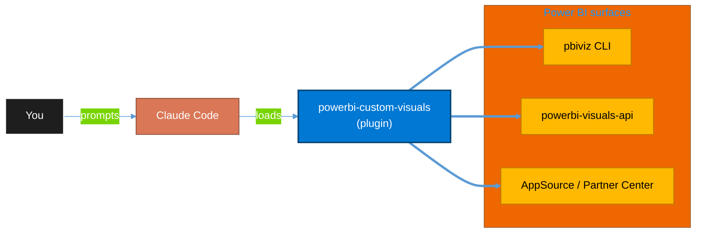

<!-- claude-m:premium-header:start -->
<div align="center">

<a id="top"></a>

# powerbi-custom-visuals

### Build, debug, package, and certify custom Power BI visuals with the pbiviz toolchain — project scaffolding, capabilities and dataView mapping, the IVisual API, the modern format pane and formatting model, selection and cross-filtering, tooltips, unit testing, and AppSource certification

<sub>Build, mirror, and govern analytics estates on Fabric.</sub>

<br />

<table align="center">
<tr>
<td align="center"><b>Category</b><br /><code>Analytics</code></td>
<td align="center"><b>Surfaces</b><br /><sub>Power BI · pbiviz · powerbi-visuals-api · D3 · TypeScript</sub></td>
<td align="center"><b>Version</b><br /><code>1.1.0</code></td>
<td align="center"><b>Marketplace</b><br /><code>claude-m-microsoft-marketplace</code></td>
</tr>
</table>

<sub><code>power-bi</code> &nbsp;·&nbsp; <code>custom-visuals</code> &nbsp;·&nbsp; <code>pbiviz</code> &nbsp;·&nbsp; <code>ivisual</code> &nbsp;·&nbsp; <code>format-pane</code> &nbsp;·&nbsp; <code>appsource</code></sub>

<a href="#install"><b>Install</b></a> &nbsp;·&nbsp;
<a href="#overview"><b>Overview</b></a> &nbsp;·&nbsp;
<a href="#architecture"><b>Architecture</b></a> &nbsp;·&nbsp;
<a href="#related-plugins"><b>Related plugins</b></a> &nbsp;·&nbsp;
<a href="../README.md"><b>Marketplace</b></a>

</div>

---

> [!TIP]
> **One-line install** — `/plugin install powerbi-custom-visuals@claude-m-microsoft-marketplace`


## Overview

> Build, debug, package, and certify custom Power BI visuals with the pbiviz toolchain — project scaffolding, capabilities and dataView mapping, the IVisual API, the modern format pane and formatting model, selection and cross-filtering, tooltips, unit testing, and AppSource certification.

`powerbi-custom-visuals` is a knowledge plugin that turns Claude Code into a Power BI visuals developer: it scaffolds projects with `pbiviz`, writes and reviews `visual.ts` / `capabilities.json` / `settings.ts` / `pbiviz.json`, and drives the build-to-certification pipeline. All guidance is grounded in the official [Power BI visuals developer docs](https://learn.microsoft.com/power-bi/developer/visuals/).

<details>
<summary><b>What ships in this plugin</b> (commands, agents, skills)</summary>

| Component | Items |
|---|---|
| **Commands** | `/pbiviz-setup` · `/pbiviz-scaffold` · `/pbiviz-capabilities` · `/pbiviz-dataview` · `/pbiviz-format-pane` · `/pbiviz-interactivity` · `/pbiviz-debug` · `/pbiviz-package` · `/pbiviz-certify` · `/pbiviz-migrate` · `/pbiviz-deneb` |
| **Agents** | `visual-reviewer` · `visual-performance-advisor` |
| **Skills** | `powerbi-custom-visuals` |

</details>

<details>
<summary><b>Quick example</b></summary>

```text
Use powerbi-custom-visuals to scaffold a D3 bar-chart visual with cross-filtering,
a format-pane color card, and tooltips — then package it for AppSource.
```

</details>

## Prerequisites

- **Node.js** (current LTS) + **npm**, and the toolchain: `npm i -g powerbi-visuals-tools@latest` (provides `pbiviz`).
- A **Power BI Pro** or **Premium Per User (PPU)** account to sideload and test, plus **developer mode** enabled in Power BI Desktop or the service.
- An IDE (VS Code recommended). For certification: a **Partner Center** account and a reviewable **GitHub** repo.
- No MCP server or cloud credentials required — this is a pure knowledge + local-CLI plugin. Run `/pbiviz-setup` to verify everything.

<a id="architecture"></a>

## Architecture



<a id="install"></a>

## Install

```bash
/plugin marketplace add markus41/Claude-m
/plugin install powerbi-custom-visuals@claude-m-microsoft-marketplace
```

> [!IMPORTANT]
> This plugin generates source files and drives the local `pbiviz` CLI. It does not connect to any service — but **certified** visuals must not access external resources, so keep `WebAccess` privileges empty when targeting AppSource certification.

[Back to top](#top)

---

<!-- claude-m:premium-header:end -->

Comprehensive knowledge plugin for **building custom Power BI visuals** — from `pbiviz new` to an AppSource-certified `.pbiviz`. This is a knowledge plugin (no runtime dependencies).

## Capabilities

| Area | What Claude Can Do |
|------|-------------------|
| Choose an approach | Recommend SDK vs Deneb (Vega/Vega-Lite) vs SVG-via-DAX vs HTML Content vs Charticulator |
| Deneb (Vega/Vega-Lite) | Author declarative specs: bind the `dataset`, cross-filter via `__selected__`/`pbiCrossFilterApply`, theme with `pbiColor`, format with `pbiFormat`, build reusable templates |
| Environment | Install/verify Node + `pbiviz`, trust the dev cert, enable developer mode |
| Scaffolding | `pbiviz new`, tailor the project to a categorical/table/matrix/single mapping |
| Capabilities | Author `capabilities.json` — data roles, dataView mappings, conditions, objects, privileges, feature flags |
| DataView | Generate parsing for categorical (grouped), table, matrix (tree), and single views; paging |
| IVisual API | Implement constructor/update/getFormattingModel/destroy with the Rendering Events API |
| Format pane | Build the modern format pane (API 5.1+) with formatting model utils; conditional formatting |
| Interactivity | Selection + cross-filter, highlight, tooltips, context menu, drill-down, bookmarks, landing page |
| Testing | ESLint (`eslint-plugin-powerbi-visuals`), jasmine/karma unit tests, security audits |
| Packaging | Fill metadata, bump the four-part version, `pbiviz package` → `.pbiviz` |
| Certification | Audit against Microsoft's requirements; prep Partner Center / AppSource submission |
| Migration | Upgrade API version; convert `enumerateObjectInstances` → `getFormattingModel` |

## Commands

| Command | Description |
|---------|-------------|
| `/pbiviz-setup` | Install Node + `pbiviz`, trust the dev cert, enable developer mode |
| `/pbiviz-scaffold` | Create a new visual project and wire it for the modern format pane |
| `/pbiviz-capabilities` | Author/edit `capabilities.json` consistently with the code |
| `/pbiviz-dataview` | Design a dataView mapping and generate the parsing code |
| `/pbiviz-format-pane` | Build format-pane cards/slices via formatting model utils |
| `/pbiviz-interactivity` | Add selection, tooltips, context menu, drill, bookmarks, landing page |
| `/pbiviz-debug` | Run `pbiviz start` and diagnose common failures |
| `/pbiviz-package` | Fill metadata, bump version, and build the `.pbiviz` |
| `/pbiviz-certify` | Certification readiness audit + AppSource submission prep |
| `/pbiviz-migrate` | Upgrade API version and modernize the format pane |
| `/pbiviz-deneb` | Author/iterate a Deneb Vega or Vega-Lite spec (cross-filter, tooltips, theme colors, templates) |

## Agents

| Agent | Description |
|-------|-------------|
| Visual Reviewer | Reviews visual source/config for correctness, certification readiness, and security |
| Visual Performance Advisor | Diagnoses render/data bottlenecks with an optimization roadmap |

## Plugin Structure

```
powerbi-custom-visuals/
├── .claude-plugin/plugin.json
├── README.md
├── skills/powerbi-custom-visuals/
│   ├── SKILL.md
│   ├── references/
│   │   ├── building-approaches.md
│   │   ├── deneb-vega.md
│   │   ├── environment-setup.md
│   │   ├── project-structure.md
│   │   ├── capabilities.md
│   │   ├── dataview-mapping.md
│   │   ├── visual-api.md
│   │   ├── formatting-model.md
│   │   ├── interactivity.md
│   │   ├── testing.md
│   │   ├── packaging-certification.md
│   │   └── utils-and-troubleshooting.md
│   └── examples/
│       ├── visual-ts-barchart.md
│       ├── capabilities-json.md
│       ├── formatting-settings.md
│       ├── pbiviz-and-config.md
│       ├── scaffold-walkthrough.md
│       └── deneb-specs.md
├── commands/
│   ├── pbiviz-setup.md
│   ├── pbiviz-scaffold.md
│   ├── pbiviz-capabilities.md
│   ├── pbiviz-dataview.md
│   ├── pbiviz-format-pane.md
│   ├── pbiviz-interactivity.md
│   ├── pbiviz-debug.md
│   ├── pbiviz-package.md
│   ├── pbiviz-certify.md
│   ├── pbiviz-migrate.md
│   └── pbiviz-deneb.md
└── agents/
    ├── visual-reviewer.md
    └── visual-performance-advisor.md
```

## Trigger Keywords

custom power bi visual, pbiviz, powerbi-visuals-tools, pbiviz new, pbiviz package, ivisual, visual.ts, capabilities.json, pbiviz.json, dataview mapping, data roles, categorical data view, matrix data view, getformattingmodel, format pane, formatting model, formattingmodel utils, selection manager, cross filtering visual, supportshighlight, visual tooltips, context menu visual, drill down visual, landing page visual, launchurl, rendering events api, color palette, fetch more data, data reduction algorithm, conditional formatting visual, certified power bi visual, appsource visual, partner center visual, developer visual, d3 power bi visual, deneb, deneb spec, deneb template, vega, vega-lite, declarative power bi visual, pbicolor, pbiformat, pbipatternsvg, pbicrossfilterapply, deneb cross-filter

## Author

Markus Ahling
<!-- claude-m:premium-footer:start -->

---

<a id="related-plugins"></a>

## Related plugins

<table>
<tr><th>Plugin</th><th>What it does</th></tr>
<tr><td><a href="../powerbi-fabric/README.md"><code>powerbi-fabric</code></a></td><td>DAX measures, Power Query M, Power BI Embedded, deployment pipelines, PBIP scaffolding, Fabric Lakehouse, Direct Lake, performance optimization</td></tr>
<tr><td><a href="../powerbi-paginated-reports/README.md"><code>powerbi-paginated-reports</code></a></td><td>Power BI paginated reports through Fabric — RDL authoring, VB.NET expressions, data source configuration, rendering/export, REST API automation, SSRS-to-Fabric migration, performance tuning, and troubleshooting</td></tr>
<tr><td><a href="../fabric-semantic-models/README.md"><code>fabric-semantic-models</code></a></td><td>Microsoft Fabric Semantic Models — Direct Lake modeling, DAX governance, calculation groups, XMLA deployment, and semantic link automation</td></tr>
<tr><td><a href="../fluent-ui-design/README.md"><code>fluent-ui-design</code></a></td><td>Microsoft Fluent 2 design system mastery — design tokens, color system, typography, layout, components, Teams theming, Griffel styling, accessibility</td></tr>
<tr><td><a href="../fabric-gitops-cicd/README.md"><code>fabric-gitops-cicd</code></a></td><td>Microsoft Fabric GitOps CI/CD — workspace Git integration, deployment pipelines, artifact promotion, branch strategy, and release validation</td></tr>
</table>


<details>
<summary><b>Composable stacks that include <code>powerbi-custom-visuals</code></b></summary>

Pair `powerbi-custom-visuals` with `powerbi-fabric` (model + report development), `fluent-ui-design` (consistent visual styling and accessibility), and `fabric-gitops-cicd` (ship the packaged visual through CI/CD). Browse the full [marketplace catalog](../README.md#plugin-catalog) for a tailored selection.

</details>

---

<div align="center">

<sub>Part of <a href="../README.md"><b>Claude-m</b></a> — the Microsoft plugin marketplace for Claude Code.</sub>

<sub>Licensed under <a href="../LICENSE">MIT</a>. Built for engineers, MSPs, SOC teams, and analytics leaders.</sub>

</div>

<!-- claude-m:premium-footer:end -->
